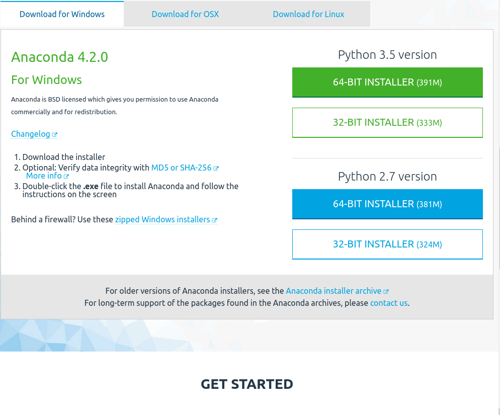
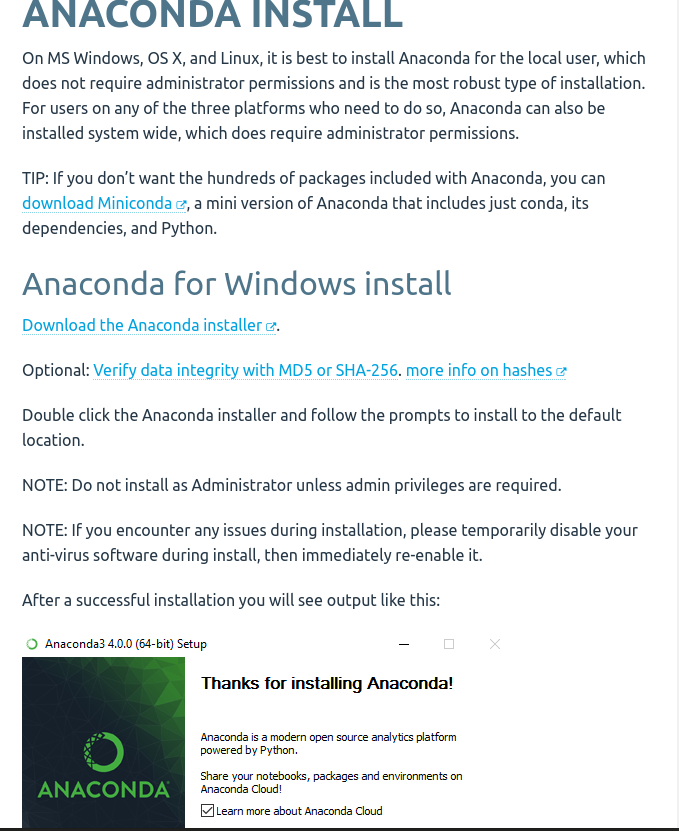
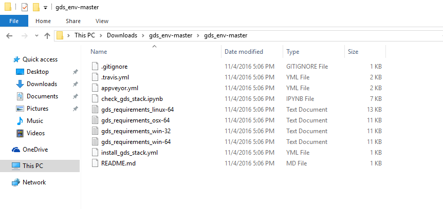
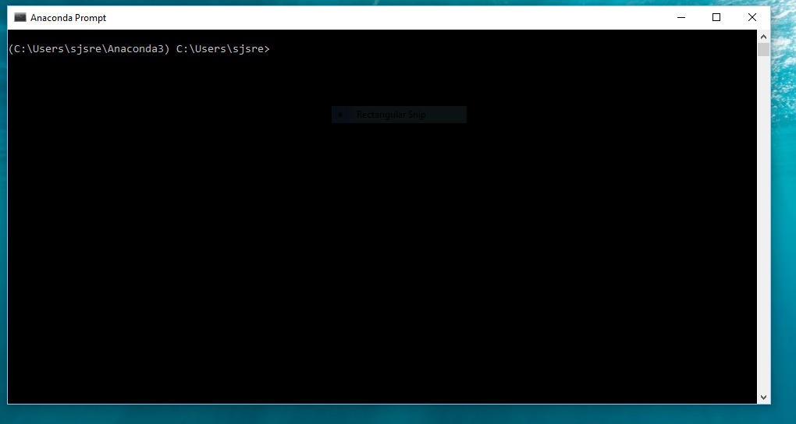
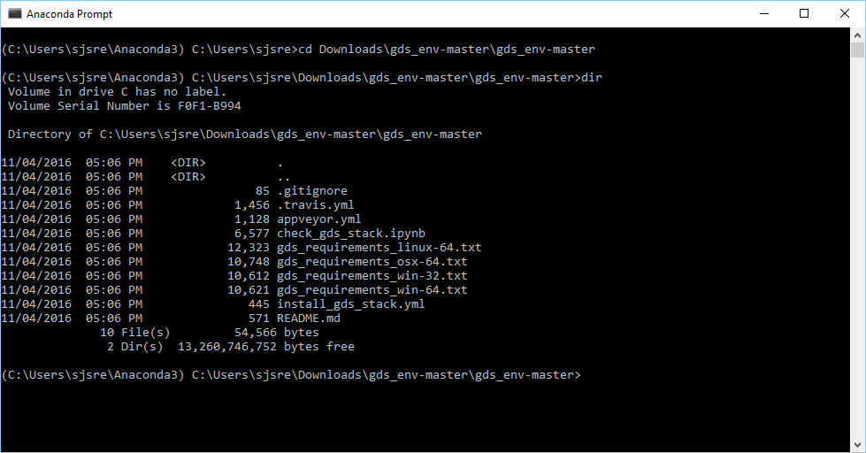
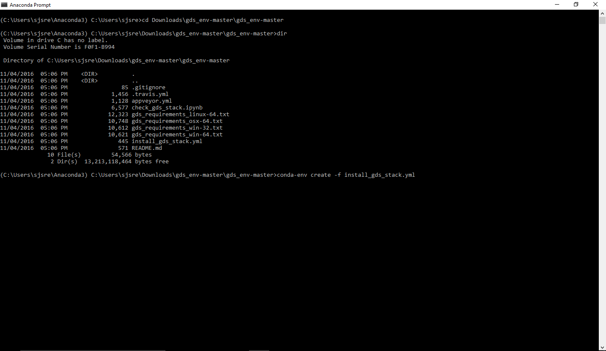
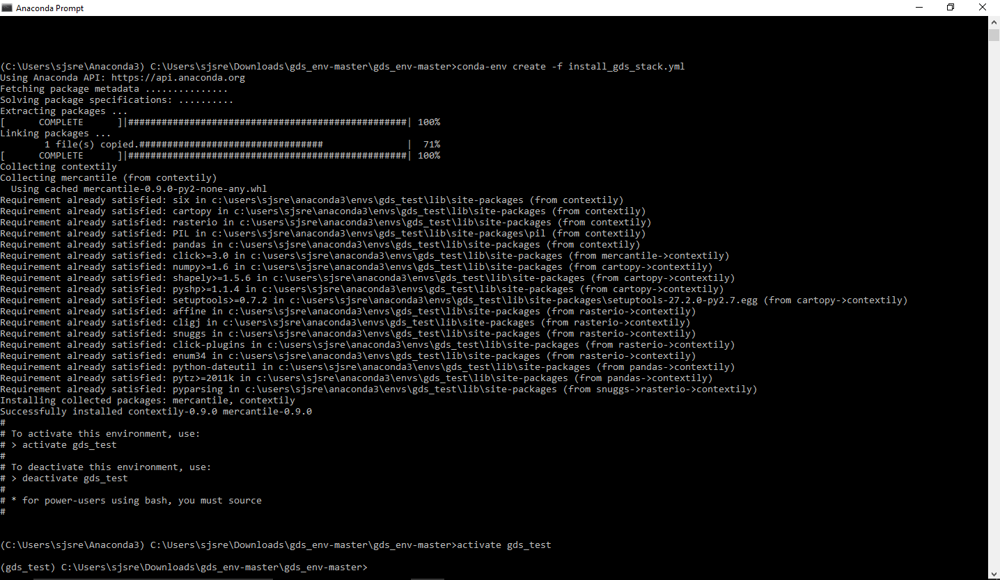

# Install Instructions: PySAL @NARSC 2016

I am looking forward to our workshop this coming Wednesday.


 Before you embark on your travels to NARSC, I would ask you to setup your own laptop with the required packages for the workshop. These are fairly large downloads so it would be more efficient for each participant to grab these packages before travel, rather than our workshop overtaxing the hotel network.

The downloads are on the order of 400megs so the time required may be on the order of 10-15 minutes, depending on your connections.

Below I give the instructions for different operating systems.

Should you have any questions please feel free to contact me at: <sjsrey@gmail.com>


I will also bring installers on usb flash drives. And there is an option to use Virtualbox, if that is your thing. (See below)


## Installation Under Windows

### 1. Download the [Python 2.7 version of Anaconda Distribution Installer](https://repo.continuum.io/archive/Anaconda2-4.2.0-Windows-x86_64.exe)



### 2. Read the [Anaconda installation instructions](https://docs.continuum.io/anaconda/install)



### 3. Download the [setup archive](  https://github.com/sjsrey/gds_env/archive/master.zip)


### 4. Extract the archive from step 3 to a working directory



### 5. From the Windows start menu select `Anaconda3 (64-bit)` and then `Anaconda Prompt`



### 6. Navigate to the archive extraction directory



### 7. Create our conda environment for the workshop
The command is:

    conda-env create -f install_gds_stack.yml




### 8. Activate your environment
    activate gds_test




### 9. Test your environment

    nbconvert --execute --ExecutePreprocessor.timeout=120 check_gds_stack.ipynb


If your screen looks like the previous image, you are good to go. If not, read through the directions again closely. If you still have issues please email.


## Installation Under Mac OS X


 ```
gauss:gds_env-master teaching$ conda-env create -f install_gds_stack.yml
 gauss:gds_env-master teaching$ source activate gds_test
(gds_test) gauss:gds_env-master teaching$ jupyter nbconvert --to markdown --execute --ExecutePreprocessor.timeout=480 check_gds_stack.ipynb 
[NbConvertApp] Converting notebook check_gds_stack.ipynb to markdown
[NbConvertApp] Executing notebook with kernel: python2
[NbConvertApp] Support files will be in check_gds_stack_files/
[NbConvertApp] Making directory check_gds_stack_files
[NbConvertApp] Making directory check_gds_stack_files
[NbConvertApp] Making directory check_gds_stack_files
[NbConvertApp] Making directory check_gds_stack_files
[NbConvertApp] Writing 6243 bytes to check_gds_stack.md
(gds_test) gauss:gds_env-master teaching$ 
```


## Installation Under Linux

If you are using Linux, I'm assuming you know how to do this :->


## VirtualBox Option

For those of you who would rather have a one-stop shopping virtual machine with all packages preinstalled, I will bring a custom vm with me to the workshop. To be able to use this, please install the [VirtualBox application](https://www.virtualbox.org/wiki/Downloads) for your operating system prior to traveling to NARSC.
